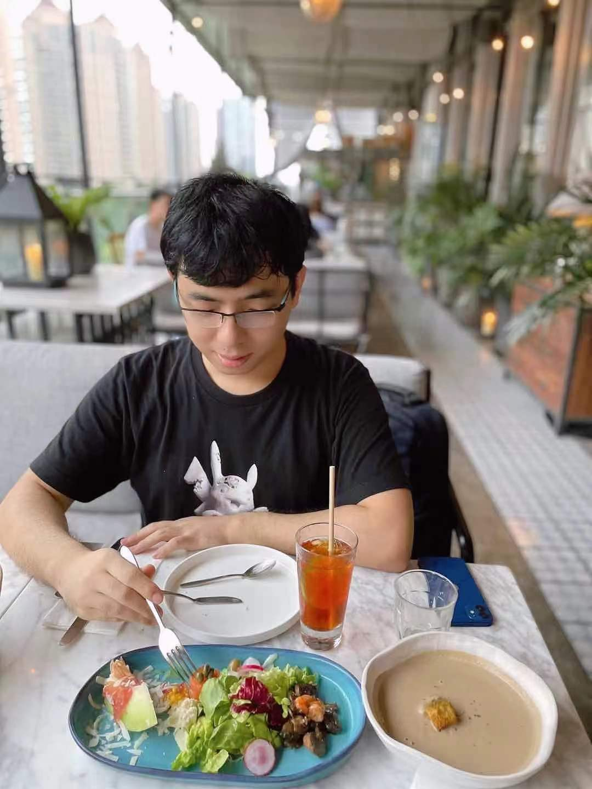

---

## Yuqi Chen

Yuqi Chen is an assistant Professor (tenure-track) at School of Information Science and Technology in the ShanghaiTech University. Yuqi completed his Ph.D. in 2019 at the Singapore University of Technology and Design (SUTD) under the supervision of Sun Jun. Besides, he also collaborated closely with Chris Poskitt. From 2019 to 2021, he worked as a Research Scientist in the System Analysis and Verification (SAV) group at Singapore Management University(SMU).

His research interest lies in cyber-physical system security in general. Specifically, he apply techniques like testing, reverse engineering, program analysis, and formal method to secure and analyze CPSs (e.g., autonomous vehicles, industrial control systems, and robotics systems).

---

## Contact Information

Email: chenyq@shanghaitech.edu.cn, phoenixcyq1994@gmail.com

Office: Room C-503.C, SIST Building 1, No.393 Huaxia Middle Road, Pudong Area Shanghai.

---

## Teaching

* CS 224: Program Analysis, Spring 2023
* CS 253: Cyber Security, Fall 2022

---

## Students

**Master Students**

* Haitao Hu (2022.09-),
* Guowei Yang (2022.09-), co-supervised with Fu Song
* Huijia Sun (2022.09-)
* Qingyuan Hu (2022.09-)
* Xuenan Zhang (2021.09-), co-supervised with Yutian Tang
* Mingke Yang (2021.09), co-supervised with Yutian Tang
